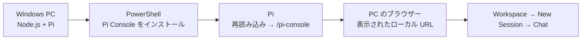
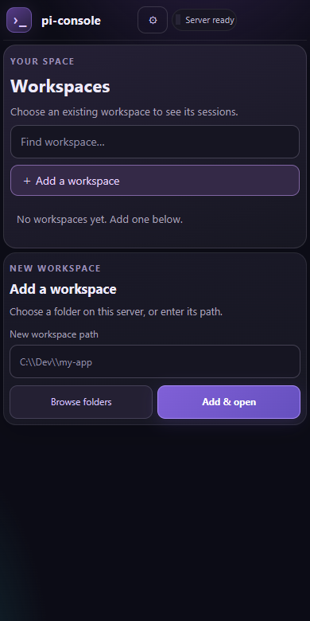
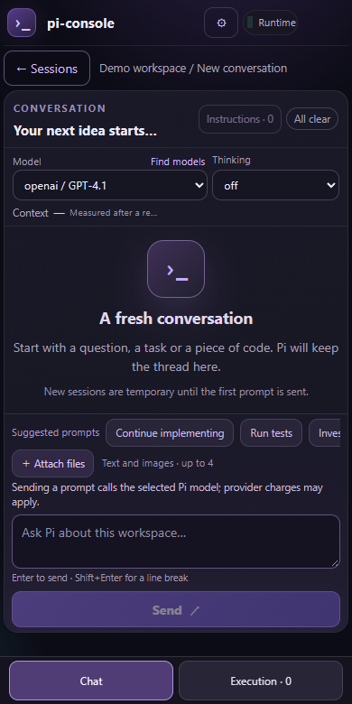

# Pi Console

[English](README.en.md)

Pi の会話と実行状況を、Windows の PC やスマートフォンのブラウザーで確認・操作するためのローカル優先の Web コンソールです。Node.js 24 以降、Pi 0.87.1 以降が必要です。Pi の TUI と**同じ会話画面ではなく**、別の Pi RPC セッションを使用します。

> **安全上の注意**：標準モードは認証なしで `127.0.0.1` にだけ接続します。LAN やインターネットへ直接公開しないでください。遠隔利用には [Cloudflare Tunnel + Access の設定](docs/cloudflare-access.md)が必要です。
>
> **旧版から更新する場合**：以前の Windows スタートアップ版は、npm の更新時に消える場所へワークスペース登録を保存していました。**更新する前に**[バックアップと移行手順](docs/upgrade-storage.ja.md)を実行してください。更新後には旧データを回収できない場合があります。

## すぐに使う

Windows PC に [Node.js 24 以降](https://nodejs.org/en/download) と [Pi 0.87.1 以降](https://github.com/earendil-works/pi) を用意します。Pi でモデルを利用するための設定も必要です。



### 1. 公開版をインストールする

**PowerShell** で実行します。`@latest` は npm で公開済みの版を指します。公開版の番号を確認してからインストールできます。

```powershell
node --version
pi --version
npm view @ludi-uni/pi-console version
pi install npm:@ludi-uni/pi-console@latest
pi list
```

npm の公開版より新しいこのリポジトリのソースを使う場合は [ローカル導入](docs/operations.ja.md#導入方法)をご覧ください。**インストールしただけでは Web サーバーは起動しません。**

### 2. Pi から起動する

Pi を再起動するか、**Pi の入力欄**で以下を順に実行します（PowerShell のコマンドではありません）。

```text
/reload
/pi-console
```

Pi が表示した URL（例：`http://127.0.0.1:31717`）を**同じ PC のブラウザー**で開きます。ポートが異なる場合は Pi の表示を優先してください。`127.0.0.1` は接続した端末自身を指すため、その URL をスマートフォンに入力しても PC には接続できません。スマートフォンなどからの遠隔利用は [Cloudflare Tunnel + Access](docs/cloudflare-access.md)を設定してください。

Pi からの起動と Windows スタートアップは、通常 `~/.pi/agent/pi-console/.env` を明示的に読み込みます。Cloudflare 用の設定を npm パッケージの外に保持できます。配置・優先順位・再起動方法は [起動時の `.env` 設定](docs/operations.ja.md#pi-からの起動と-windows-スタートアップの-env)をご覧ください。

### 3. 最初のセッションを作る

1. **Workspaces** で PC 上の作業フォルダーを選ぶか、**Add a workspace** から登録します。
2. **New Session** を押します。初回は Pi の拡張機能の読み込みに最大約1分かかる場合があります。
3. **Chat** でモデルを確認し、指示を送ります。送信すると選択したモデルのプロバイダー料金が発生する場合があります。

画面例（モバイル幅・デモ用ワークスペースとモデル。表示は設定により異なります）：

| ワークスペースを登録 | 新しいセッションの Chat |
| --- | --- |
|  |  |

最初に `Server ready · no Pi session` と表示されるのは、セッションを選ぶ前の正常な状態です。画面の使い方は [使い方ガイド](docs/usage.ja.md)をご覧ください。

### うまく起動しないとき

| 状況 | 確認すること |
| --- | --- |
| `pi` コマンドが見つからない | Pi のインストールと PowerShell の再起動を確認します。 |
| `/pi-console` が使えない | Pi で `/reload` を実行するか Pi を再起動し、`pi list` で登録を確認します。 |
| ブラウザーから接続できない | Pi を終了せず、Pi に表示された URL を同じ PC で開きます。 |
| セッションの起動が失敗する | 画面のエラーを確認し、**New Session** を再試行します。繰り返す場合は [運用・開発ガイド](docs/operations.ja.md)を参照してください。 |

ソースからの導入、単独の `npm start`、保存先や起動設定は [運用・開発ガイド](docs/operations.ja.md)にまとめています。

## 目的別ガイド

| やりたいこと | 説明 |
| --- | --- |
| 会話、ファイルのプレビュー、実行状況を使う | [使い方](docs/usage.ja.md) |
| データの保存先、起動設定、テストを確認する | [運用・開発ガイド](docs/operations.ja.md) |
| 旧版から安全に更新する | [更新前のバックアップと移行](docs/upgrade-storage.ja.md) |
| 保護された遠隔アクセスを設定する | [Cloudflare Tunnel + Access（英語）](docs/cloudflare-access.md) |
| 内部設計を調べる | [設計資料への案内](docs/operations.ja.md#設計資料) |

## 任意のペット素材

フィオ（素材の権利表示：DOLL Project / Ludi）は `package/pets/fio/` に画像と設定を同梱しています。画像にはソフトウェアの MIT License ではなく別途 [Fio Character Asset License](package/pets/fio/FIO_ASSET_LICENSE.md) が適用されます。Codex やユーザー領域のパッケージなしで利用できます（8 列 × 11 行、バージョン 2）。Codex 公式の組み込みペット画像は配布していません。Pi Console は OpenAI と無関係の独立したプロジェクトであり、OpenAI の承認を受けていません。サーバーの `~/.pi-console/pets`、`~/.codex/pets`、従来の Pi agent の保存先も検索し、カスタムパッケージを優先します。設定 → ペットで保存元・種類の選択と再検索ができます。利用可能な画像がない場合はペットを表示しません。利用権のある素材だけを使用してください。

ソースコードは [MIT License](LICENSE) です。依存関係と素材の権利については [配布時の注意](docs/operations.ja.md#ライセンスと配布)をご確認ください。
